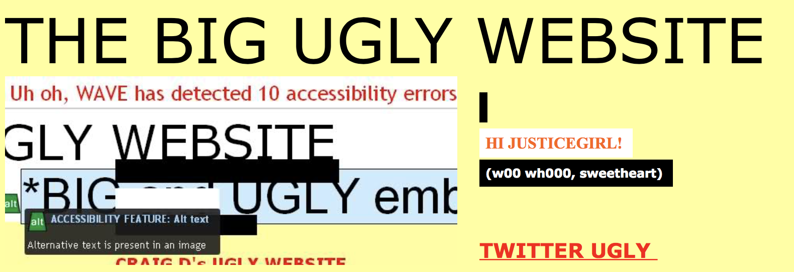
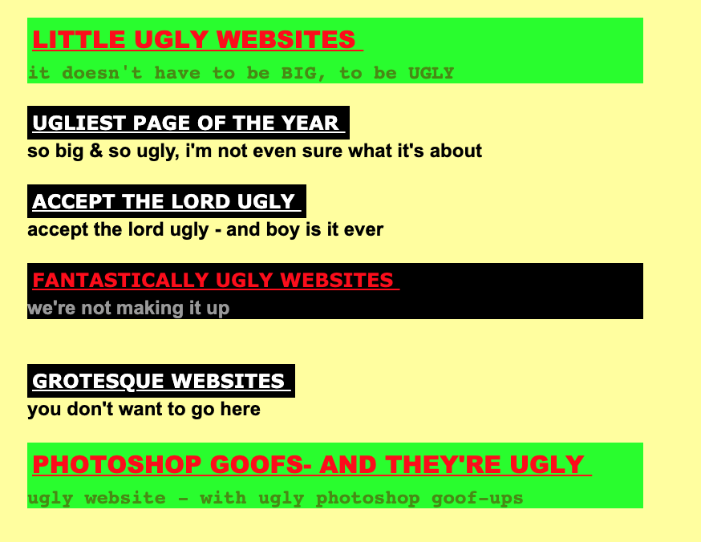
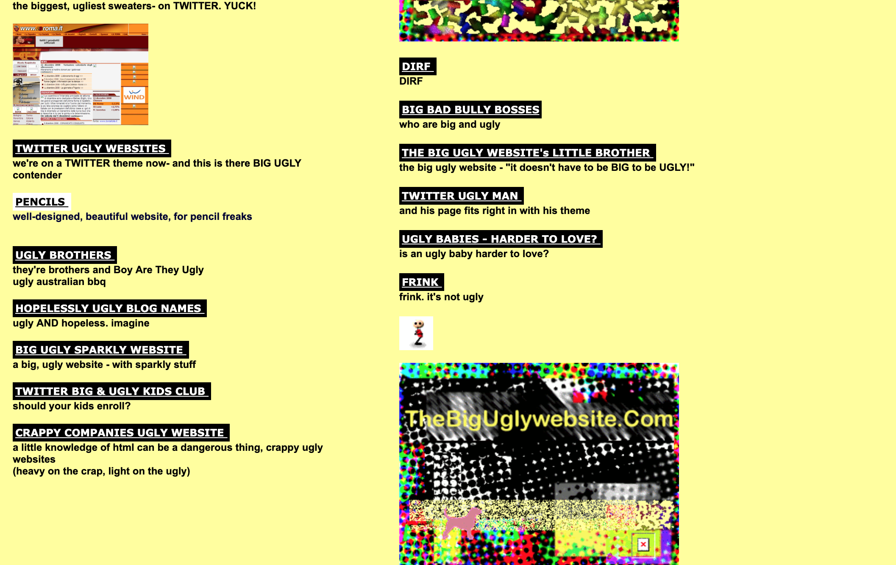

# website markdown

## What website did you find (url, name,...) 
* The big ugly website
* http://thebiguglywebsite.com
 

## Does it get regular updates ?
 *  The website does not recieve regular updates, there is information on it dating from 1980.

# 3.How did you find it?
---

1. You go to [google](http://www.google.com).
1. Typing  *"ugly website"*
1. The second result will be our perfect website.

---
Let's have a look at our website! 
---

# 4.Why does this website need an update / complete makeover ?
---
1. Too messy.
1. Ugly color choice. 
Red and Green?

1. Font size is too small.

